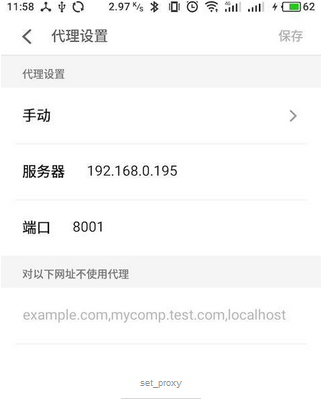

# Windows使用AnyProxy抓包
>说明：AnyProxy开源代理，一个跨平台代理软件，比Charles好用。特别是抓https包，可以基于它二次开发。具体介绍见AnyProxy官网 https://github.com/alibaba/anyproxy

>demo 基于anyproxy的微信公众号文章爬取，包含阅读数点赞数 https://www.jianshu.com/p/4e227083b238
### 准备、安装Node.js
>地址：https://nodejs.org/en/download/

>修改Nodejs内置的npm默认配置路径
>>1.打开cmd命令行，查看当前配置

>>输入 npm config ls

>>安装好这里需要修改两个路径，module路径和cache路径

>>module对应prefix

>>cache对应cache

>>首先在别的盘新建两个目录

>>F:\Crazyly\node\node_modules\npm\node_global_modules

>>F:\Crazyly\node\node_modules\npm\node_cache

>>然后依次执行

>>npm config set prefix"F:\Crazyly\node\node_modules\npm\node_global_modules"

>>npm config set cache"F:\Crazyly\node\node_modules\npm\node_cache"

>如果镜像地址链接不上

>> 切换国内镜像地址
>> 
>> pm config set registry https://registry.npm.taobao.org 

>>npm info underscore （如果上面配置正确这个命令会有字符串response）

### 1、安装
```javascript
     sudo npm install -g anyproxy
```
### 2、启动
```javascript
     anyproxy --port 8001
     //成功启动后可以直接访问8002端口进入anyproxy 控制面板
     //http://127.0.0.1:8002
     //同时监听8001端口请求
```
### 3、客户端设置代理
* 服务器ip
* 端口 8001
* 网络请求并观测，是否过程中有做拦截操作
* 

### 4、配置https
* 原理 AnyProxy 解析 https 的原理是自制跟证书rootCA在终端信任这份证书之后，在用它签发各个域名的二级证书可以重新对各个页面进行解析
* 生成rootCA 输入 anyproxy -ca
* 打开rootCA.crt 生成命令之后后会弹出证书所在目录，或者根据提示你找到该目录后双击打开，去安装
* 以支持https方式重新启动AnyProxy  输入 anyproxy --intercept

### 5、其他
*卸载  npm uninstall anyproxy
*清除证书 anyproxy --clear

### 6、规则文件
* 1、AnyProxy 提供了二次开发的能力，可以使用js编写自己的规则模块，来定义网络请求的处理逻辑
* 2、控制完整的请求头、请求体、响应头、响应体、可以在客户端与服务端都无感知的情况下介入处理所有的流程
* 3、把网络通信过程分解为三个阶段

        * 在收到客户端请求后，允许开发者直接从本地提供返回
        * 在转发请求到服务器前,允许开发者对发送的请求进行修改
        * 在收到服务器响应后，允许开发者对响应内容进行修改，再返回给客户端
        
* 4、开发规则

        * 编写规则文件rule.js
            ```javascript
                //允许Https 解析
                module.exports = {
                    shouldInterceptHttpsReq : function (req){
                        return true;
                    }
                };
           ```

        * 启动并加载规则
            输入 ： anyproxy --rule ./rule.js
        * 测试规则

            * 使用客户端请求并观测

            *使用curl 测试  
              // 直接请求服务器
              curl https://github.com
              //通过代理服务器请求
              curl https://github.com --proxy http://127.0.0.1:8001 

* 5、加载显示规则
    输入 anyproxy --rule https://sample.com/rule.js
* 6、更多规则使用请参考官方文档